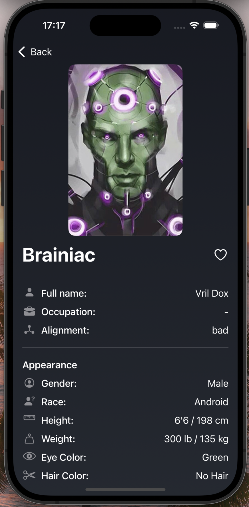

# Hero Randomizer

Hero Randomizer is an iOS app that displays a random superhero from the Superhero API. Built using SwiftUI, this project showcases network requests, JSON parsing, and dynamic UI updates.


## Features
- Fetch a random hero from the Superhero API
- Display hero details (name, image, power stats, biography, etc.)
- Dynamic UI with color-based alignment
- Smooth SwiftUI interface

### How It Works
1. Tap "Roll a Hero" to fetch a random hero.
2. The app makes an API request to fetch superhero data.
3. The selected hero’s image, name, power stats, and biography are displayed.
4. Hero alignment (Good, Bad, Neutral) changes the UI color.

### API Details
- Base URL: 
```
https://akabab.github.io/superhero-api/
```
- Endpoint for all heroes: 
```
https://akabab.github.io/superhero-api/api/all.json
```
### Screenshots



